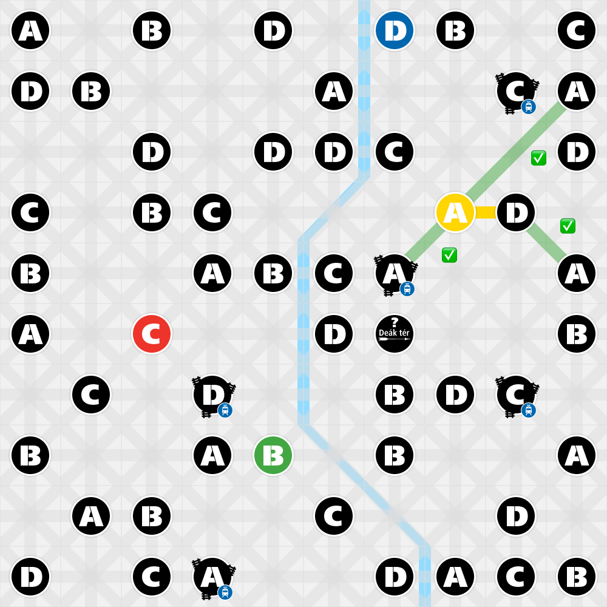

# Subways of Budapest 🚇

A browser-based puzzle game inspired by the real Budapest metro network. Players build metro lines by drawing segments between stations on a grid, following card-based rules while managing scoring across multiple rounds.


## Gameplay

Each round, players are dealt station cards (A, B, C, D, or Joker) and must connect stations by drawing segments along a 10×10 grid. Lines must follow strict routing rules — no crossings, no loops, no passing through intermediate stations — and can travel at both 90° and 45° angles. After 8 cards, the round ends and a new metro line begins.

**Scoring** rewards covering multiple city districts, crossing the Danube, and building junction stations shared between multiple lines.

## Features

- 4 metro lines (M1–M4) with historically accurate colors
- 53 stations mapped across Budapest's districts and both sides of the Danube
- Diagonal segment drawing (45° angles)
- Full scoring system: district coverage, Danube crossings, junction bonuses, and train station bonuses
- Live score tracking with a slider indicator during gameplay
- Round order pre-generated and displayed throughout the game
- Rules screen accessible from the main menu
- Bilingual UI (Hungarian / English)

## Tech Stack

- Vanilla JavaScript (no frameworks)
- HTML5 Canvas / DOM rendering
- JSON data files for stations and metro lines

## Screenshots

| Main Menu | Game Board |
|-----------|-----------|
|  |  |

## Getting Started

No build step required — just open `index.html` in a browser.

```bash
git clone https://github.com/your-username/subways-of-budapest.git
cd subways-of-budapest
open index.html
```

## Project Structure

```
├── index.html
├── script.js         # Core game logic
├── stations.json     # Full station data (type, district, side of Danube)
├── stations-min.json # Lightweight station data
├── lines.json        # Metro line definitions and colors
└── assets/           # Tile sprites and station graphics
```

## Status

Active development. Core gameplay and scoring are complete. Planned additions:
- Leaderboard with local storage persistence
- Alternative round-ending conditions
- Switch card mechanic

## License

MIT